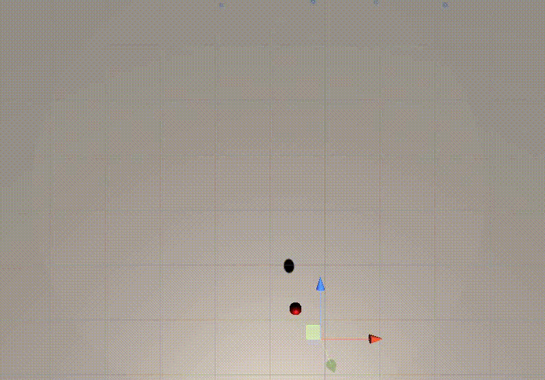

## Visualisation Of Boids Algorithm in Unity

Project created for Engineer's Thesis. 

This repository includes basic simulation which presents boids algorithm, originally invented by Craig Reynolds. 

To present practical use of algorithm in game development, "Space Boids" was created. 
You can see more details and play game here: [my itch.io page](https://containedx.itch.io/space-boids)

Part of Engineer's Thesis was some researches. I examined how field of view affects flock. 

You can see measurements in [research](research) folder. 
